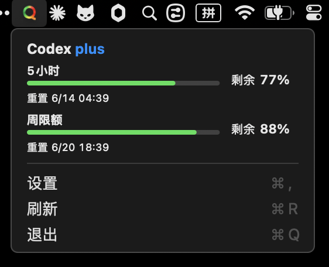
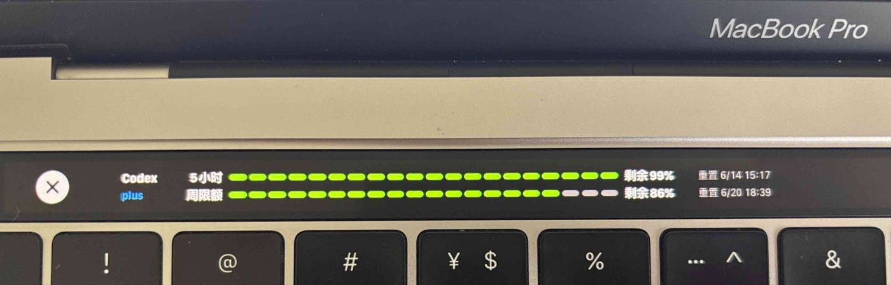
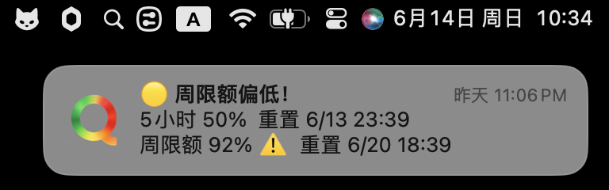

# Quota

[简体中文](README.zh-CN.md)

Quota is a lightweight macOS menu bar app for monitoring [Codex](https://github.com/openai/codex) rate limits.

<p align="center">
  
  
  
</p>

> [!NOTE]
> Quota requires Codex CLI or Codex.app, and your account must expose valid rate limit data.

## Features

- Menu bar quota overview for Codex 5-hour and weekly limits
- Touch Bar display when Terminal or Codex is the active app
- macOS notifications when quota is running low
- Automatic refresh every 2 minutes, plus manual refresh
- Proxy settings for Codex app-server connectivity
- Global hotkey for opening the menu bar popover
- Language switcher with System, English, and Simplified Chinese options
- Accessory app mode: no Dock icon
- Reads quota data through Codex `app-server`, preferring `codex` from `PATH` and falling back to `/Applications/Codex.app`

## Screenshots

### Menu Bar



### Touch Bar



### Low Quota Notification



## Installation

### Download DMG

Download the latest `Quota-*.dmg` from [GitHub Releases](https://github.com/slightlee/quota/releases), open it, and drag `Quota.app` into `Applications`.

### Build From Source

```bash
git clone https://github.com/slightlee/quota.git
cd quota
bash Scripts/package-app.sh
ditto .build/package/Quota.app /Applications/Quota.app
```

Then launch `Quota.app` from `Applications`.

To launch Quota at login:

**System Settings -> General -> Login Items -> Add Quota**

Do not install the raw `.build/release/Quota` executable directly. Notifications, app icons, and bundled resources rely on the standard `.app` bundle structure.

## Usage

After launch, Quota appears in the macOS menu bar. Wait a few seconds for the first quota refresh.

- Click the menu bar icon to view 5-hour and weekly quota details
- Click `Refresh` or press `⌘R` to refresh manually
- Click `Settings` to configure proxy, global hotkey, and language options
- Click `Quit` or press `⌘Q` to exit

Touch Bar appears only when Terminal or Codex is the active app.

### Notification Thresholds

Quota sends low-quota notifications at these default remaining-percent thresholds:

- Below 20%: warning
- Below 10%: urgent
- Below 5%: critical

Each threshold is notified once per quota window. Notification state resets after the remaining quota recovers above 50%.

## Packaging

### Build `.app`

```bash
bash Scripts/package-app.sh
```

Output:

```text
.build/package/Quota.app
```

### Build `.dmg`

```bash
bash Scripts/package-dmg.sh
```

Output:

```text
.build/Quota-<version>.dmg
```

The DMG includes a Finder installer layout with `Quota.app` on the left and an `Applications` shortcut on the right. In CI environments where Finder scripting is unavailable, packaging falls back to a default DMG layout.

## How It Works

```text
┌──────────────┐     JSON-RPC (stdio)     ┌──────────────┐
│              │ ◄──────────────────────► │              │
│    Quota     │   account/rateLimits/    │    Codex     │
│              │         read             │ (app-server) │
└──────┬───────┘                          └──────┬───────┘
       │                                         │
       ▼                                         ▼
 ┌──────────────────────────┐             ┌──────────────────────┐
 │ MenuBarController        │             │ TouchBarController   │
 │ + MenuBarLimitView       │             │ + TouchBarLimitView  │
 └──────────────────────────┘             └──────────────────────┘
```

Quota starts Codex `app-server` as a child process and reads quota data through JSON-RPC over stdin/stdout. It refreshes quota data every 2 minutes.

## Requirements

- macOS 14 Sonoma or later
- Codex CLI or Codex.app
- A Codex account with rate limit data

## Development

```bash
# Run locally
swift run

# Build .app
bash Scripts/package-app.sh

# Build .dmg
bash Scripts/package-dmg.sh

# View debug logs
swift run 2>&1 | grep "\[Quota\]"
```

## Contributing

Issues and pull requests are welcome.

## License

[MIT](LICENSE)
