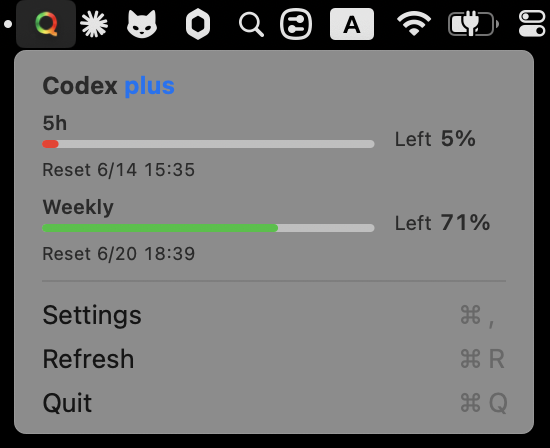
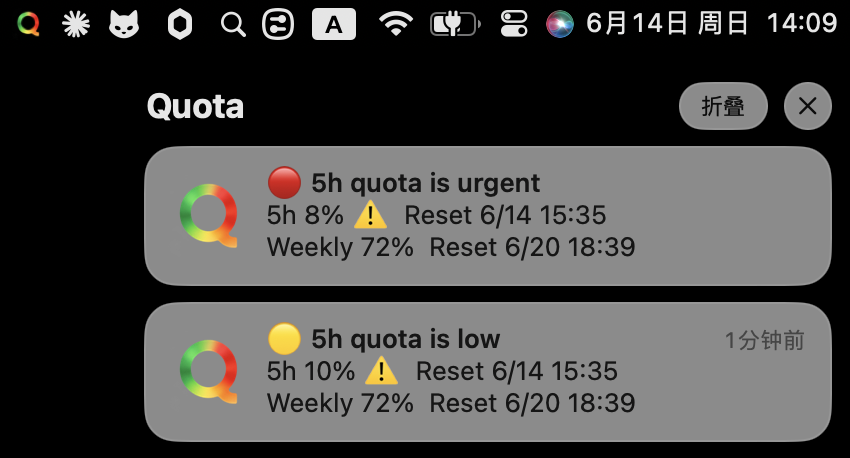

# Quota

[简体中文](README.zh-CN.md)

Quota is a lightweight macOS menu bar app for monitoring AI coding quota — [Codex](https://github.com/openai/codex), [Claude](https://claude.com/claude-code) (Claude Code), [Grok](https://x.ai) (Grok Build / CLI), and [Xiaomi MiMo](https://github.com/XiaomiMiMo/MiMo-Code) (MiMoCode / Token Plan).

<p align="center">
  
  
  
</p>

> [!NOTE]
> **Codex:** requires Codex CLI, ChatGPT.app, or Codex.app, with an account that exposes rate limit data.
>
> **Claude:** requires Claude Code signed in (`claude`). Quota reads the login token from the macOS Keychain (via the system `security` tool — no permission prompt).
>
> **Grok:** requires Grok CLI signed in (`grok login`). Some networks need a proxy to reach Grok billing.
>
> **MiMo:** requires MiMoCode signed in to Xiaomi and a Token Plan. Xiaomi's quota endpoint uses the web-console session rather than the `tp-...` API key; add the console Cookie in **Settings → Providers**.

## Features

- Menu bar popup for **Codex** (5-hour + weekly limits, reset credits when available), **Claude** (5-hour session + weekly limits, including per-model weekly pools), **Grok** (weekly usage pool), and **MiMo** (Token Plan Credits)
- Provider filter tabs: All / each enabled provider; enable up to 5 providers and drag to reorder in Settings
- First enabled provider in the list is primary: leftmost provider tab, status-item summary, and Touch Bar when available
- macOS notifications when remaining quota is low (per provider / window)
- Automatic refresh every 2 minutes, plus manual refresh
- Proxy settings (useful for Codex app-server and Grok billing)
- Global hotkey to open or close the menu bar popup (same as clicking the status item)
- Languages: System, English, Simplified Chinese
- Accessory mode: no Dock icon

## Screenshots

English screenshots use the English UI. Chinese screenshots live in [README.zh-CN.md](README.zh-CN.md).

### Menu Bar

Light mode:



Dark mode:


### Touch Bar


> Touch Bar is only available on Macs that include one. On newer MacBooks without a Touch Bar, use the menu bar popup. The Touch Bar strip layout may differ slightly from the menu bar popup.

### Low Quota Notifications



## Installation

### Download DMG

Download the latest `Quota-*.dmg` from [GitHub Releases](https://github.com/slightlee/quota/releases), open it, and drag `Quota.app` into `Applications`.

### Build From Source

```bash
git clone https://github.com/slightlee/quota.git
cd quota
bash Scripts/package-app.sh
ditto .build/package/Quota.app /Applications/Quota.app
```

Then launch `Quota.app` from `Applications`.

To launch Quota at login:

**System Settings → General → Login Items → Add Quota**

Do not install the raw `.build/release/Quota` executable directly. Notifications, app icons, and bundled resources rely on the standard `.app` bundle structure.

## Usage

After launch, Quota appears in the menu bar. Wait a few seconds for the first refresh.

- Click the menu bar icon (or the global hotkey) to open or close the popup
- Switch **All** / provider icons at the top to filter the view
- While the popup is open: `⌘R` refresh · `⌘,` settings · `⌘Q` quit · `Esc` dismiss
- **Settings → Providers:** enable services (max 5; click a row or the checkbox), drag to reorder; the first enabled row is primary

### Providers

| Provider | Data source | What you see |
|----------|-------------|--------------|
| **Codex** | Local `codex app-server` (`account/rateLimits/read`) | 5-hour + weekly windows; reset credits when available |
| **Grok** | Local `~/.grok/auth.json` + Grok CLI billing API | Weekly usage window (same source as Grok CLI `/usage`) |
| **Claude** | Claude Code OAuth login + Anthropic usage API | 5-hour session and weekly pools |
| **MiMo** | MiMoCode `auth.json` + Xiaomi Token Plan console | Combined plan and compensation Credits |

#### Xiaomi MiMo setup

1. Run `mimo` and sign in to the `xiaomi` provider. Quota automatically reads the account and regional Base URL from MiMoCode's `auth.json`.
2. Sign in at [Xiaomi MiMo Token Plan](https://platform.xiaomimimo.com/console/plan-manage).
3. In browser Developer Tools, copy the complete `Cookie` request header from a request to `platform.xiaomimimo.com`.
4. Open **Quota → Settings → Providers**, paste it into **MiMo Cookie**, and save.

The Cookie is stored only in macOS Keychain. It is never written to Quota preferences or the repository. If MiMo later shows an authorization error, repeat steps 2–4 to refresh the expired web session.

### Notification Thresholds

Default remaining-percent thresholds (each provider and window independently):

- Below 20%: warning
- Below 10%: urgent
- Below 5%: critical

Each threshold fires once per window until remaining recovers above 50%.

## Packaging

### Build `.app`

```bash
bash Scripts/package-app.sh
```

Output:

```text
.build/package/Quota.app
```

### Build `.dmg`

```bash
bash Scripts/package-dmg.sh
```

Output:

```text
.build/Quota-<version>.dmg
```

The DMG includes a Finder installer layout with `Quota.app` on the left and an `Applications` shortcut on the right. In CI environments where Finder scripting is unavailable, packaging falls back to a default DMG layout.

## How It Works

```text
                    ┌─────────────────────────────┐
                    │            Quota            │
                    │     (menu bar + settings)   │
                    └───────┬───────────┬─────────┘
                            │           │
           JSON-RPC stdio   │           │  HTTPS + local auth
           app-server       │           │  ~/.grok/auth.json
                            ▼           ▼
                   ┌──────────────┐  ┌──────────────────────────┐
                   │    Codex     │  │  Grok CLI billing API    │
                   │ (app-server) │  │  cli-chat-proxy.grok.com │
                   └──────────────┘  └──────────────────────────┘
```

- **Codex:** starts a local `app-server` child process and reads rate limits over JSON-RPC (stdin/stdout). Prefers `codex` on `PATH`, then the binary bundled with ChatGPT.app or Codex.app.
- **Grok:** reads the OIDC access token from `~/.grok/auth.json` (after `grok login`) and calls the same billing endpoint the Grok CLI uses for usage.
- **Claude:** reads the Claude Code OAuth login and calls Anthropic's usage endpoint.
- **MiMo:** discovers the signed-in Xiaomi provider from MiMoCode and calls the Token Plan console usage endpoint with the web-session Cookie stored in Keychain.
- Data refreshes about every 2 minutes.

## Privacy

Quota reads quota data on your machine through local CLI/login state and provider endpoints. It does not upload quota or account data to any third-party analytics service of its own.

Proxy, hotkey, language, and provider settings are stored locally in macOS app preferences. The MiMo console Cookie is stored separately in macOS Keychain.

## Troubleshooting

- **No menu bar icon:** launch `Quota.app` from `Applications`, not the raw `.build/release/Quota` binary.
- **No Codex data:** install Codex CLI, ChatGPT.app, or Codex.app; sign in with an account that exposes rate limits; ensure `codex` is on `PATH` or the app is in `/Applications`.
- **No Grok data:** run `grok login` so `~/.grok/auth.json` exists; if requests time out, enable a proxy (Settings → Proxy) on restricted networks.
- **No MiMo data:** run `mimo` and sign in to Xiaomi, then update **Settings → Providers → MiMo Cookie** from a signed-in Xiaomi console request.
- **No notifications:** allow notifications for Quota in System Settings (requires a proper `.app` bundle).

## Requirements

- macOS 14 Sonoma or later
- For Codex: Codex CLI, ChatGPT.app, or Codex.app + account with rate limit data
- For Grok: Grok CLI signed in (`grok login`)
- For Claude: Claude Code signed in
- For MiMo: MiMoCode signed in to Xiaomi + an active Token Plan

## Development

```bash
# Run locally
swift run

# Build .app
bash Scripts/package-app.sh

# Build .dmg
bash Scripts/package-dmg.sh

# View debug logs
swift run 2>&1 | grep "\[Quota\]"
```

## Contributing

- Found an issue? Please open an [Issue](https://github.com/slightlee/quota/issues).
- Have a good idea? Pull requests are welcome via [Pull Requests](https://github.com/slightlee/quota/pulls).
- If Quota is useful to you, consider giving the project a star.

## Community

- [LINUX DO](https://linux.do)

## License

[MIT](LICENSE)
