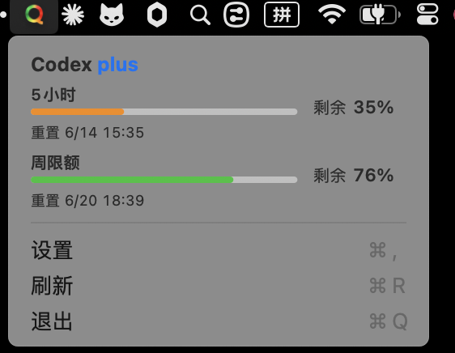
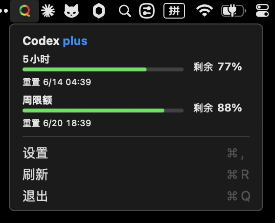
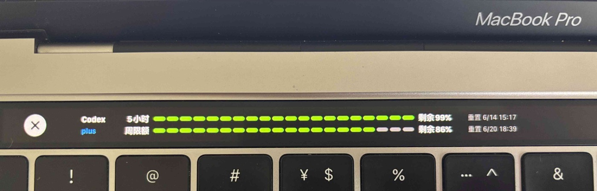
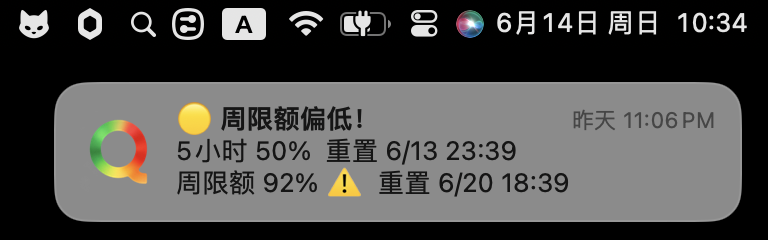

# Quota

[English](README.md)

Quota 是一个轻量级 macOS 菜单栏应用，用于查看 AI 编程额度 —— 支持 [Codex](https://github.com/openai/codex)、[Claude](https://claude.com/claude-code)（Claude Code）、[Grok](https://x.ai)（Grok Build / CLI）与[小米 MiMo](https://github.com/XiaomiMiMo/MiMo-Code)（MiMoCode / Token Plan）。

<p align="center">
  
  
  
</p>

> [!NOTE]
> **Codex：** 需要 Codex CLI、ChatGPT.app 或 Codex.app，且账户能返回 rate limit 数据。
>
> **Claude：** 需要已登录的 Claude Code（`claude`）。Quota 通过系统 `security` 工具从 macOS 钥匙串读取登录令牌，无需授权弹窗。
>
> **Grok：** 需要已登录的 Grok CLI（`grok login`）。部分网络环境访问 Grok 计费接口时可能需要代理。
>
> **MiMo：** 需要 MiMoCode 已登录小米账号并开通 Token Plan。小米额度接口使用网页控制台会话，而不是 `tp-...` API key；请在 **设置 → 服务** 中填写控制台 Cookie。

## 特性

- 菜单栏同时支持 **Codex**（5 小时 + 周限额，有重置额度时显示）、**Claude**（5 小时会话 + 周限额，含按模型的周额度）、**Grok**（周额度）与 **MiMo**（Token Plan Credits）
- 弹窗顶部可切换「全部 / 各服务」；设置中最多启用 5 个服务，可拖拽排序
- 排序最前的已启用服务为优先服务（服务 tab 靠左、状态栏摘要、有 Touch Bar 时也显示在 Touch Bar）
- 额度不足时按厂商、按窗口发送 macOS 通知
- 约每 2 分钟自动刷新，也支持手动刷新
- 代理设置（Codex app-server / Grok 请求均可使用）
- 全局快捷键打开或关闭弹窗（与点击菜单栏图标相同）
- 语言：跟随系统 / 英文 / 简体中文
- Accessory 模式，不占 Dock

## 截图

中文界面截图如下；英文界面见 [README.md](README.md)。

### 菜单栏

浅色模式：



深色模式：



### Touch Bar



> Touch Bar 仅在带 Touch Bar 的 Mac 上可用。无 Touch Bar 的机型请使用菜单栏弹窗。Touch Bar 条带布局可能与菜单栏弹窗略有差异。

### 额度通知



## 安装

### 下载 DMG

从 [GitHub Releases](https://github.com/slightlee/quota/releases) 下载最新的 `Quota-*.dmg`，打开后将 `Quota.app` 拖入 `Applications`。

### 从源码构建

```bash
git clone https://github.com/slightlee/quota.git
cd quota
bash Scripts/package-app.sh
ditto .build/package/Quota.app /Applications/Quota.app
```

然后从 `Applications` 启动 `Quota.app`。

如需开机自启：

**系统设置 → 通用 → 登录项 → 添加 Quota**

不建议直接运行或复制 `.build/release/Quota` 裸二进制；通知权限、应用图标和资源依赖标准 `.app` 包结构。

## 使用

启动后菜单栏会出现 Quota 图标，稍等片刻自动获取数据。

- 点击菜单栏图标（或全局快捷键）打开或关闭弹窗
- 用顶部 **全部** / 各服务图标切换视图
- 弹窗打开时：`⌘R` 刷新 · `⌘,` 设置 · `⌘Q` 退出 · `Esc` 关闭
- **设置 → 服务：** 启用服务（最多 5 个，可点整行或勾选框），拖动排序；最前的已启用项为优先服务

### 支持的服务

| 服务 | 数据来源 | 展示内容 |
|------|----------|----------|
| **Codex** | 本地 `codex app-server`（`account/rateLimits/read`） | 5 小时 + 周限额；有重置额度时显示 |
| **Grok** | 本地 `~/.grok/auth.json` + Grok CLI 计费接口 | 周额度窗口（与 Grok CLI `/usage` 同源） |
| **Claude** | Claude Code OAuth 登录 + Anthropic 用量接口 | 5 小时会话和周额度池 |
| **MiMo** | MiMoCode `auth.json` + 小米 Token Plan 控制台 | 套餐与补偿 Credits 的合计额度 |

#### 小米 MiMo 配置

1. 运行 `mimo`，登录 `xiaomi` 服务。Quota 会自动读取 MiMoCode `auth.json` 中的账号和区域 Base URL。
2. 登录[小米 MiMo Token Plan 控制台](https://platform.xiaomimimo.com/console/plan-manage)。
3. 在浏览器开发者工具中，从任意 `platform.xiaomimimo.com` 请求复制完整的 `Cookie` 请求头。
4. 打开 **Quota → 设置 → 服务**，粘贴到 **MiMo Cookie** 后保存。

Cookie 只保存在 macOS 钥匙串，不会写入 Quota 偏好或代码仓库。如果之后提示 MiMo 未授权，重复第 2–4 步更新已过期的网页会话。

### 通知阈值

默认在以下**剩余额度**阈值发送通知（各厂商、各窗口独立）：

- 低于 20%：普通提醒
- 低于 10%：紧急提醒
- 低于 5%：严重不足

每个阈值每个窗口只提醒一次；剩余恢复到 50% 以上后可再次提醒。

## 打包

### 生成 `.app`

```bash
bash Scripts/package-app.sh
```

输出：

```text
.build/package/Quota.app
```

### 生成 `.dmg`

```bash
bash Scripts/package-dmg.sh
```

输出：

```text
.build/Quota-<version>.dmg
```

DMG 默认包含固定 Finder 安装窗口布局：左侧为 `Quota.app`，右侧为 `Applications` 快捷入口。若 CI 无法控制 Finder，会降级为默认布局但仍生成可用 DMG。

## 工作原理

```text
                    ┌─────────────────────────────┐
                    │            Quota            │
                    │     （菜单栏 + 设置）         │
                    └───────┬───────────┬─────────┘
                            │           │
           JSON-RPC stdio   │           │  HTTPS + 本地登录
           app-server       │           │  ~/.grok/auth.json
                            ▼           ▼
                   ┌──────────────┐  ┌──────────────────────────┐
                   │    Codex     │  │  Grok CLI 计费接口         │
                   │ (app-server) │  │  cli-chat-proxy.grok.com │
                   └──────────────┘  └──────────────────────────┘
```

- **Codex：** 启动本地 `app-server` 子进程，经 stdin/stdout 的 JSON-RPC 读取额度。优先使用 `PATH` 中的 `codex`，否则回退到 ChatGPT.app / Codex.app 内置二进制。
- **Grok：** 读取 `grok login` 写入的 `~/.grok/auth.json`，请求与 Grok CLI `/usage` 相同的计费接口。
- **Claude：** 读取 Claude Code OAuth 登录态并请求 Anthropic 用量接口。
- **MiMo：** 从 MiMoCode 自动识别小米登录项，并用钥匙串中的网页会话 Cookie 请求 Token Plan 控制台用量接口。
- 数据约每 2 分钟刷新一次。

## 隐私

Quota 在本地通过 CLI/登录态与对应服务端读取额度，不会把额度或账号信息上传到自有的第三方分析服务。

代理、快捷键、语言和服务设置保存在本机 macOS 应用偏好中；MiMo 控制台 Cookie 单独保存在 macOS 钥匙串。

## 常见问题

- **菜单栏没有图标：** 请从 `Applications` 启动 `Quota.app`，不要直接运行 `.build/release/Quota`。
- **没有 Codex 数据：** 确认已安装 Codex CLI / ChatGPT.app / Codex.app 并登录；`codex` 在 `PATH` 中，或应用在 `/Applications`。
- **没有 Grok 数据：** 先执行 `grok login`；若请求超时，在设置里配置代理（部分网络环境需要）。
- **没有 MiMo 数据：** 先运行 `mimo` 并登录小米，再从已登录的小米控制台请求更新 **设置 → 服务 → MiMo Cookie**。
- **没有通知：** 在系统设置中检查 Quota 的通知权限（需标准 `.app` 安装）。

## 系统要求

- macOS 14 Sonoma 或更高版本
- Codex：Codex CLI、ChatGPT.app 或 Codex.app + 可读 rate limit 的账户
- Grok：已登录的 Grok CLI（`grok login`）
- Claude：已登录的 Claude Code
- MiMo：MiMoCode 已登录小米 + 有效的 Token Plan

## 开发

```bash
# 本地运行
swift run

# 生成 .app
bash Scripts/package-app.sh

# 生成 .dmg
bash Scripts/package-dmg.sh

# 查看调试日志
swift run 2>&1 | grep "\[Quota\]"
```

## 贡献

- 发现问题？请提交 [Issue](https://github.com/slightlee/quota/issues)。
- 有好想法？欢迎提交 [Pull Request](https://github.com/slightlee/quota/pulls)。
- 如果 Quota 对你有帮助，可以给项目一个 Star。

## 社区

- [LINUX DO](https://linux.do)

## 许可证

[MIT](LICENSE)
